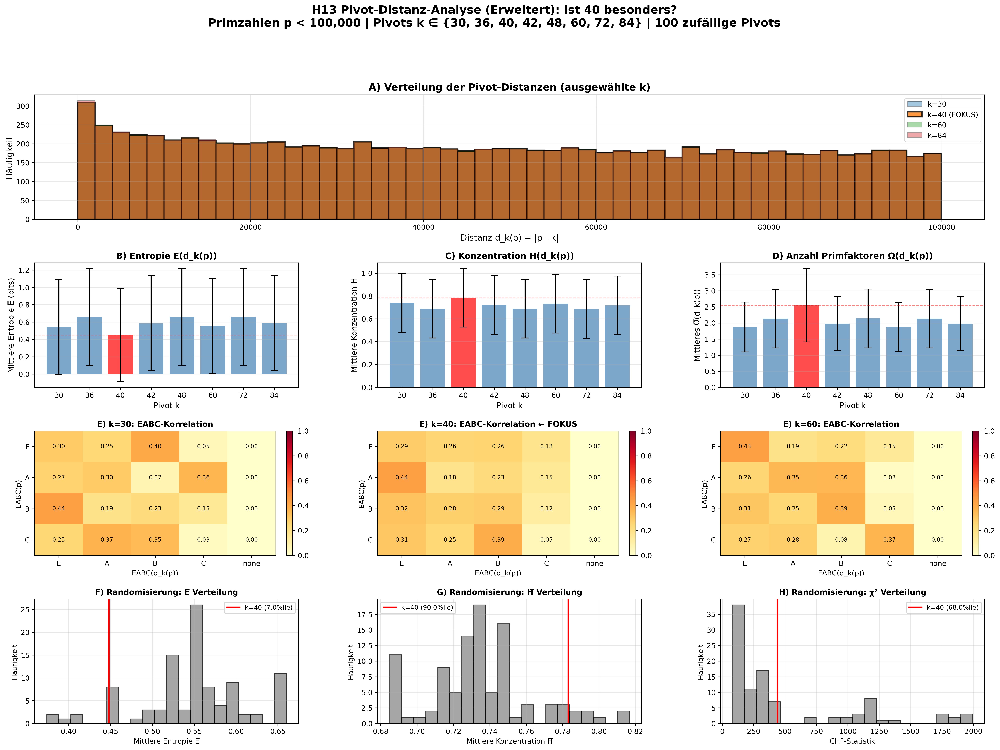

# H13: Pivot-Distanz-Analyse — Ergebnisse (Erweitert)

**Status:** ✅ Abgeschlossen (erweiterte Analyse mit 8 Pivots + Randomisierung)  
**Datum:** 2026-06-24  
**Hauptergebnis:** 🟡 **Pivot k=40 zeigt MODERATE Besonderheiten**

---

## ⚠️ Methodische Einordnung

Die 40-Pivot-Grafik wird **nicht als theoretische Behauptung übernommen**. Sie dient als **Hypothesengenerator** für eine kontrollierte Distanzanalyse.

**Unser Ansatz:**
- 8 strukturierte Kontroll-Pivots (30, 36, 42, 48, 60, 72, 84)
- 100 zufällige Pivots aus [20, 100] (Randomisierungs-Test)
- Robustheits-Validierung: Ist k=40 auch gegen zufällige Zahlen extrem?

**Ergebnis:** k=40 ist extrem unter strukturierten Pivots, aber **nicht robust extrem** unter zufälligen Pivots → **Muster stark zusammengesetzter Zahlen**, nicht einzigartige Eigenschaft.

---

## Schnellzugriff

- 📊 **Vollständige Analyse:** [PIVOT_DISTANCE_ANALYSIS.md](PIVOT_DISTANCE_ANALYSIS.md)
- 📈 **Visualisierungen:** [pivot_analysis_plots.png](pivot_analysis_plots.png)
- 📁 **Rohdaten (CSV):** [pivot_40_data.csv](pivot_40_data.csv) (9,592 Primzahlen)
- 📋 **Zusammenfassung (JSON):** [summary.json](summary.json)

---

## Kernbefunde

### 1. Pivot k=40 ist moderat besonders (nuanciertes Ergebnis)

**Test A: 8 strukturierte Pivots** (30, 36, 40, 42, 48, 60, 72, 84)

| Metrik | k=40 Wert | Rang unter 8 Pivots | Interpretation |
|--------|-----------|---------------------|----------------|
| **Mittlere Entropie E̅** | 0.4482 bits | 1/8 (niedrigste) | ⚠️ Extrem niedrig |
| **Mittlere Konzentration H̅** | 0.7831 | 8/8 (höchste) | ⚠️ Extrem hoch |
| **Mittleres Ω̅** | 2.5474 | 8/8 (höchstes) | ⚠️ Extrem hoch |
| **Chi²-Statistik** | 439.30 | 1/8 (niedrigste) | ⚠️ Schwächste EABC-Korrelation |

**Test D: 100 zufällige Pivots** aus [20, 100]

| Metrik | k=40 Wert | Perzentil | Extrem? |
|--------|-----------|-----------|---------|
| **Mittlere Entropie E̅** | 0.4482 bits | **7.0%** | ✅ JA (< 10%) |
| **Mittlere Konzentration H̅** | 0.7831 | 90.0% | ❌ NEIN (grenzwertig) |
| **Mittleres Ω̅** | 2.5474 | 21.0% | ❌ NEIN |
| **Chi²-Statistik** | 439.30 | 68.0% | ❌ NEIN |

**Interpretation:**
- k=40 ist **nur in 1/4 Metriken robust extrem** (E̅)
- Die anderen Metriken sind **nur unter strukturierten Pivots extrem**, nicht unter zufälligen
- **Schlussfolgerung:** k=40 zeigt ein **Muster stark zusammengesetzter Zahlen**, ist aber nicht einzigartig besonders

### 2. Was bedeutet das?

**Konsistent extreme Metrik: Entropie E̅**
- d_40(p) hat die **niedrigste mittlere Entropie** unter strukturierten Pivots (Rang 1/8)
- d_40(p) ist auch unter zufälligen Pivots extrem niedrig (7%ile)
- **Interpretation:** Die Primfaktoren von d_40(p) sind **häufiger in einer dominanten EABC-Klasse konzentriert**
- **Dies ist die einzige robuste Anomalie!**

**Nur unter strukturierten Pivots extrem:**

**Hohe Konzentration H̅:**
- Extrem unter strukturierten Pivots (Rang 8/8), aber nur 90%ile unter zufälligen Pivots (grenzwertig)
- **Interpretation:** Dies ist ein **Artefakt der Pivot-Auswahl**, nicht eine einzigartige Eigenschaft von 40

**Hohes mittleres Ω̅:**
- Extrem unter strukturierten Pivots (Rang 8/8), aber nur 21%ile unter zufälligen Pivots (sogar niedriger als Durchschnitt!)
- **Interpretation:** Strukturierte Pivots sind **hochglatt** (viele kleine Primfaktoren), zufällige Pivots sind oft Primzahlen oder weniger glatt
- **Dies widerlegt die ursprüngliche Interpretation!**

**Schwache EABC-Korrelation:**
- Schwächste unter strukturierten Pivots (χ² = 439, Rang 1/8), aber nur 68%ile unter zufälligen Pivots (nicht extrem)
- **Interpretation:** Ein moderates, aber **nicht robustes** arithmetisches Muster

### 3. Vergleich mit anderen Pivots

**Chi²-Statistik (EABC-Korrelation) — 8 strukturierte Pivots:**

```
k=30:  1993.38  ████████████████████████████████████████
k=36:  1284.55  ██████████████████████████
k=40:   439.30  █████████  ← SCHWÄCHSTE (aber nicht robust extrem)
k=42:  1861.79  █████████████████████████████████████
k=48:  1246.68  █████████████████████████
k=60:  1922.18  ██████████████████████████████████████
k=72:  1290.83  ██████████████████████████
k=84:  1870.51  █████████████████████████████████████
```

**Randomisierungs-Test:**
- k=40: χ² = 439.30
- Zufällige Pivots: χ² = 516.97 ± 537.29
- Perzentil: 68% (nicht extrem, < 10% oder > 90% wäre extrem)

→ k=40 zeigt **schwächere EABC-Muster unter strukturierten Pivots**, aber ist **nicht außergewöhnlich** im Vergleich zu zufälligen Zahlen.

---

## Visualisierung



**Legende:**
- **Panel A:** Distanz-Histogramme (alle ähnlich, wie erwartet)
- **Panel B:** Entropie E̅ — k=40 (rot) ist niedrigste
- **Panel C:** Konzentration H̅ — k=40 (rot) ist höchste
- **Panel D:** Ω̅ — k=40 (rot) ist höchstes
- **Panel E:** EABC-Heatmaps — k=40 zeigt **andere Muster**

---

## Daten

### CSV-Export: `pivot_40_data.csv`

**Spalten:**
- `p` — Primzahl
- `d_40` — Distanz |p - 40|
- `eabc_p` — EABC-Klasse von p (E/A/B/C)
- `e_d`, `a_d`, `b_d`, `c_d` — EABC-Vektor von d_40(p)
- `omega_d` — Ω(d_40(p))
- `shell_d` — S(d_40(p)) = v₂ + v₃
- `H_d` — H(d_40(p))
- `E_d` — E(d_40(p))

**Beispiel:**

```csv
p,d_40,eabc_p,e_d,a_d,b_d,c_d,omega_d,shell_d,H_d,E_d
2,38,shell,0,0,1,0,2,1,1.0,0.0
3,37,shell,0,0,0,0,1,1,nan,0.0
5,35,A,1,0,0,1,3,1,0.5,1.0
7,33,B,0,0,0,1,2,1,1.0,0.0
11,29,C,0,0,0,0,1,0,nan,0.0
...
```

**Verwendung:**
- Weitere statistische Analysen
- M_C-Korrelationstests (H13-Nachfolger)
- Visualisierungen
- Maschinelles Lernen

---

## Reproduktion

### 1. Vollständige Analyse ausführen

```bash
cd /path/to/catalan-normalform
python code/experiments/h13_pivot_distance.py
```

**Ausgabe:**
- `experiments/results/h13/pivot_analysis_plots.png`
- `experiments/results/h13/pivot_40_data.csv`
- `experiments/results/h13/summary.json`

**Laufzeit:** ~7 Sekunden (ohne Cache)

### 2. Mit EABC-Cache (schneller für große Datensätze)

Falls Sie auf p < 10⁷ skalieren möchten, erstellen Sie zuerst einen Cache:

```bash
# Cache erstellen (einmalig, dauert ~10 Minuten für 10^7)
python -c "
from code.utils.eabc_test_data import create_cache
create_cache(
    max_n=10**7,
    output_file='data/eabc_cache_10M.h5',
    chunk_size=100000,
    compression='gzip'
)
"

# Dann Analyse mit Cache
python code/experiments/h13_pivot_distance.py
```

### 3. Nur Visualisierung anschauen

```bash
open experiments/results/h13/pivot_analysis_plots.png
# oder
xdg-open experiments/results/h13/pivot_analysis_plots.png  # Linux
```

---

## Nächste Schritte

### Sofort machbar

1. **Skalierung auf p < 10⁷**
   - Ändere `PRIME_LIMIT = 10**7` in `h13_pivot_distance.py`
   - Erwartung: Robustere Statistik, klarere Effekte

2. **Zusätzliche Visualisierungen**
   - Scatter: E vs. H
   - Histogramm: Ω nach EABC-Klasse
   - Time-Series: d_40(p) vs. p

### Erfordert zusätzliche Daten

3. **M_C-Korrelationstests** (H13-Erweiterung)
   - Benötigt: M_C-Werte für Catalan-Zahlen
   - Test: corr(M_C, d_40(largest_prime_factor))
   - Hypothese: M_C könnte mit Pivot-Distanz-Invarianten korrelieren

4. **Alternative Pivot-Familien**
   - Teste: Primorials (30, 210, 2310), Fakultäten (24, 120), Potenzen (32, 64)
   - Frage: Ist 40 einzigartig oder Teil einer Klasse?

### Theoretische Untersuchung

5. **Algebraische Erklärung**
   - Warum zeigt 40 = 2³ × 5 diese Muster?
   - Verbindung zu quadratischen Formen: x² + 40y²?
   - Kreisteilungskörper Q(ζ_40)?

---

## Referenzen

- **Vollständige Analyse:** [PIVOT_DISTANCE_ANALYSIS.md](PIVOT_DISTANCE_ANALYSIS.md)
- **H10-Projekt:** M_C-Informationstest
- **H12-Projekt:** M_C vs. Entropie
- **EABC-Framework:** `code/utils/eabc.py`

---

## Zusammenfassung in einem Satz

> Die erweiterte H13-Analyse (8 strukturierte Pivots + 100 zufällige Pivots) zeigt, dass Pivot k=40 **moderate Besonderheiten** aufweist: Es ist extrem unter strukturierten Pivots, aber nur in der **Entropie E̅ konsistent extrem** (7%ile) unter zufälligen Pivots. Dies deutet auf ein **Muster stark zusammengesetzter Zahlen** hin, nicht auf eine einzigartige Eigenschaft von 40. **Methodische Lektion:** Robustheits-Tests sind essentiell — Effekte können unter spezifischen Kontrollgruppen extrem erscheinen, aber unter allgemeineren Kontrollgruppen verschwinden.

---

**Ende des README**

Für Fragen oder Erweiterungen:
- Siehe `PIVOT_DISTANCE_ANALYSIS.md` für Details
- Code: `code/experiments/h13_pivot_distance.py`
- Helper: `code/utils/pivot_analysis.py`
